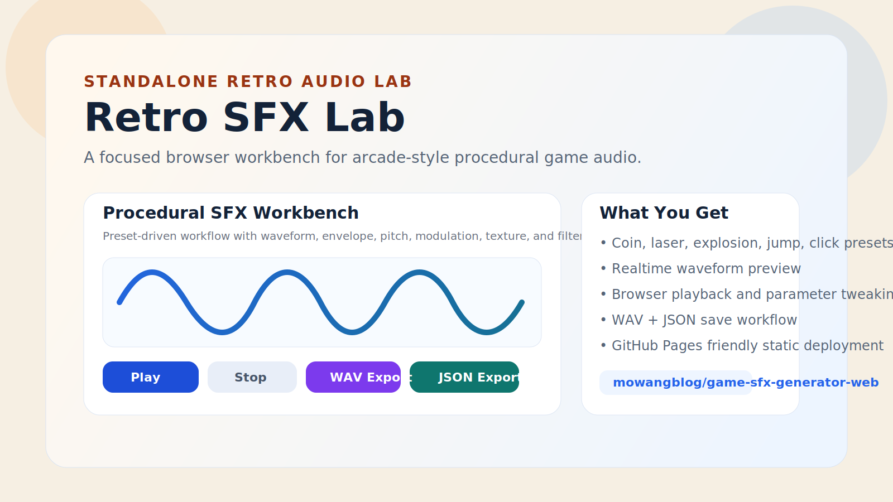

# Retro SFX Lab

Retro SFX Lab is an open-source browser tool for generating crunchy retro and arcade-style game sound effects. It focuses on the fast `sfxr`-style workflow: pick a preset, tweak parameters, preview instantly, and export the result for your game.

## Live Demo

- GitHub Pages: [mowangblog.github.io/game-sfx-generator-web](https://mowangblog.github.io/game-sfx-generator-web/)

## Screenshots

### Landing View



### Generator Workbench


## Highlights

- Procedural sound generation inspired by `sfxr` and `jsfxr`
- Fast presets for coin, laser, explosion, jump, click, pickup, and more
- Realtime browser playback while tuning parameters
- Export generated audio as `WAV`
- Export and re-import parameter sets as `JSON`
- Focused standalone repo extracted from a larger media tooling project

## Why This Repo Exists

This repository is the dedicated home for the game sound generator experience. It was split out from a broader toolset so the audio workflow can be easier to maintain, present, and iterate on as an independent open-source project.

## Local Development

Install dependencies:

```bash
npm install
```

Start the dev server:

```bash
npm run dev
```

Run tests:

```bash
npm run test
```

Create a production build:

```bash
npm run build
```

## GitHub Pages Deployment

This repo includes a GitHub Actions workflow at `.github/workflows/deploy.yml`.

To enable deployment:

1. Open the repository on GitHub.
2. Go to `Settings` -> `Pages`.
3. Set `Source` to `GitHub Actions`.
4. Push to `main` and GitHub will publish the contents of `dist/` automatically.

The Vite `base` path is already configured for this repository, so the deployed app will load correctly from `/game-sfx-generator-web/`.

## Tech Stack

- `React`
- `TypeScript`
- `Vite`
- `Vitest`

## Roadmap

- More curated preset banks for common game genres
- Sharable preset URLs or importable preset packs
- Additional waveform and modulation controls
- Small gallery of ready-to-use example sounds

## License

`GPL-3.0-only`